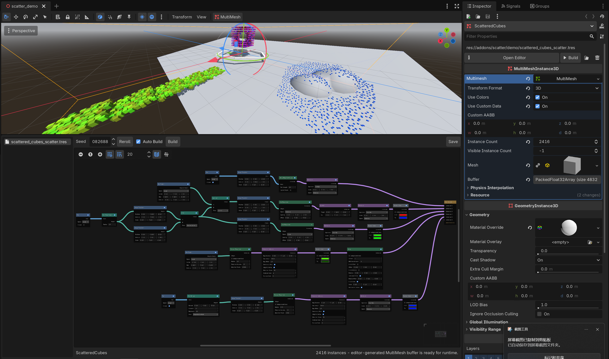

# Scatter for Godot 4.7+

> [!WARNING]
> Scatter is under active development. APIs, recipe formats, node behavior, and editor workflows may change without migration support. Use it in production only if you are comfortable tracking breaking changes.

Scatter is a visual, editor-only scattering tool for Godot's native `MultiMeshInstance3D`. It builds instance transforms, colors, and custom data through a node graph, then writes the result directly into a `MultiMesh` buffer.

It does not add custom nodes to your scene tree and it does not evaluate the graph at runtime. A built scene contains an ordinary `MultiMeshInstance3D`, so runtime rendering stays on Godot's standard MultiMesh path.



## Why Scatter?

- **Native scene structure** — work directly on `MultiMeshInstance3D`; no Scatter-specific scene nodes are required.
- **Visual authoring** — compose shapes, placement algorithms, transforms, filters, and instance data in a GraphEdit-based editor.
- **Editor-only generation** — build once in the editor and use the saved MultiMesh buffer at runtime.
- **Reusable recipes** — graphs are external `.tres` resources referenced by scene metadata.
- **Deterministic output** — seeded random operations are reproducible and individual nodes can use independent seeds.
- **Viewport tools** — draw paths and paint regions directly in the 3D editor.
- **Godot-native editing** — Undo/Redo, node enable controls, right-click menus, Delete, copy, cut, paste, and duplicate are integrated with the editor.
- **Extensible architecture** — custom value types, node models, views, gizmos, and viewport tools can be registered by other addons.

## Current capabilities

### Shape and path authoring

- Box and sphere regular regions with exact direct sampling.
- Editable paths with viewport handles, open/closed modes, and arc-length sampling.
- Painted surface regions driven by physics collision queries.
- Path Tube Region and Path Extrude for converting paths into volumes.
- Shape Transform with adaptive `Shape`, `Region`, `Regular Region`, and `Path` ports.
- Union, Intersection, and Subtract operations with configurable result pivots.
- Global and MultiMesh-local authoring spaces.

### Placement

- Random volume or path placement.
- 3D grid placement with Global, Local, and shape-instance coordinate spaces.
- Deterministic Poisson placement for volumes and paths.
- Random, even, and continuous placement along paths.
- Single-instance creation and explicit instance-stream merging.

### Instance processing

- Position, rotation, scale, and combined transform editing.
- Random transform and random rotation.
- Array duplication, Look At, snapping, relaxation, and mask-based clustering.
- Physics projection onto colliders.
- Remove Outside and Remove Random filters.
- Random color and custom-data generation.
- Ordered, variadic Final Output inputs for combining multiple instance streams.

## Requirements

- Godot **4.7 or newer**.
- A 3D project using `MultiMeshInstance3D`.
- Collision geometry is required for Paint Region and collider projection workflows.
- No C# or GDExtension dependency is required; the addon is implemented in GDScript.

## Installation

1. Download or clone this repository.
2. Copy the `addons/scatter` directory into your Godot project so the plugin file is located at:

   ```text
   res://addons/scatter/plugin.cfg
   ```

3. Open the project in Godot.
4. Go to **Project > Project Settings > Plugins**.
5. Enable **Scatter**.

If the project was already open while copying or updating the addon, allow Godot to finish importing the scripts. Restart the editor if the plugin does not appear immediately.

## Quick start

1. Add a `MultiMeshInstance3D` to your scene.
2. Assign the mesh you want to instance to its `MultiMesh` resource. Scatter can create a compatible local `MultiMesh` during Build, but it still needs a mesh to render.
3. Select the `MultiMeshInstance3D`.
4. In the Inspector, click **Create** to save and link a new Scatter recipe, or click **Load** to link an existing `.tres` recipe.
5. Click **Open Editor** to open the Scatter bottom panel.
6. Edit the graph and click **Build**.
7. Click **Save** or press **Ctrl+S** while the Scatter editor has focus to save the recipe.
8. Save the scene to persist the recipe link and generated MultiMesh buffer.

The default recipe starts with this graph:

```text
Box Region
    |
Random Placement
    |
Randomize Rotation
    |
Edit Scale
    |
Final Output
```

Change the Box size, adjust the Random amount, and press **Build** to see the first result.

## Example graphs

### Scatter inside a volume

```text
Sphere Region -> Poisson Placement -> Randomize Rotation -> Final Output
```

Use `Radius` on Poisson Placement to control the minimum distance between instances.

### Place instances along a path

```text
Path -> Along Edge Even -> Edit Scale -> Final Output
```

Select the Path node to activate its viewport toolbar. Add points by clicking colliders or the camera-facing edit plane, move points with handles, and optionally close the path.

### Combine multiple outputs

```text
Box Region -> Grid Placement ---------------------> Final Output [1]
Path -> Along Edge Random -> Randomize Rotation --> Final Output [2]
```

Final Output accepts multiple ordered `Instances` connections. Results are appended in connection order.

### Build a compound volume

```text
Box Region ----> Subtract [A] -> Random Placement -> Final Output
Sphere Region -> Subtract [B]
```

Boolean operators output a general Shape. Random sampling therefore uses deterministic rejection sampling over the resulting bounds rather than direct regular-region sampling.

## Recipes, saving, and building

Scatter deliberately separates graph persistence from instance generation:

| Action | What it changes |
| --- | --- |
| **Create** | Creates a new `.tres` recipe and stores an external-resource reference in the selected node's metadata. |
| **Load** | Links an existing Scatter recipe by reference. It does not copy the graph into the scene. |
| **Edit** | Changes an in-memory working copy. The linked `.tres` is not silently overwritten. |
| **Save / Ctrl+S** | Writes the current working graph to the linked `.tres` recipe. |
| **Build** | Evaluates the working graph and writes transforms, colors, and custom data into the MultiMesh buffer. |
| **Auto Build** | Rebuilds output after applicable graph edits. It does **not** save the recipe. |
| **Save Scene** | Persists the metadata link and generated MultiMesh buffer in the scene. |
| **Detach** | Removes only the Scatter metadata link. It keeps the `.tres` file and current MultiMesh buffer unchanged. |

The recipe sidebar lists open editing sessions. A `*` suffix marks a recipe with unsaved graph changes. Closing the scene discards that scene's unsaved working copy; reopening it loads the last explicitly saved recipe.

Godot omits script properties that equal their defaults from textual `.tres` files. For example, a scale of `(1, 1, 1)` may not appear as a line in the file, but it is restored correctly when the recipe is loaded.

## Graph editing

- Right-click empty space to add nodes.
- Right-click nodes for Cut, Copy, Paste, Delete, Duplicate, Enable, and Disable actions.
- Right-click a connection to disconnect it.
- Press **Delete** to remove selected nodes.
- Standard Godot copy, cut, paste, duplicate, Undo, and Redo shortcuts are supported.
- Use the checkbox in a node title bar to enable or disable that node.
- Final Output cannot be disabled or deleted.
- Incompatible connections and graph cycles are rejected.
- Parameter edits, node movement, connections, deletion, viewport painting, and path edits participate in editor Undo/Redo.

## Viewport editing

The last selected graph node owns the active Scatter gizmo or viewport tool. Deselecting it exits that editing mode.

### Path

Selecting a Path node exposes **Edit Points**, **Add Points**, **Delete Points**, and **Closed** controls in the 3D viewport toolbar.

- **Edit Points** moves existing points with viewport handles.
- **Add Points** appends points on collision surfaces, falling back to a camera-facing plane.
- **Delete Points** removes the clicked point.
- **Insert** switches to Add Points and **Escape** returns to Edit Points.

### Paint Region

Selecting a Paint Region node exposes Paint, Erase, Radius, Clear Layer, and Collision Mask controls. Brush strokes are stored in the recipe and support Undo/Redo.

## Value and coordinate model

Ports are strongly typed. Compatibility is defined by a multiple-parent type registry:

```text
value
|-- shape
|   |-- region
|   |   |-- regular_region
|   |   `-- planar_region
|   `-- path
|-- direct_sampleable
|   |-- regular_region
|   |-- planar_region
|   `-- path
`-- instances
```

- **Shape** provides local bounds and point containment.
- **Region** is a containable Shape and may have a 2D or 3D intrinsic sampling domain.
- **Regular Region** can sample directly and exactly; Box and Sphere are regular regions.
- **Planar Region** is a true two-dimensional polygon embedded in 3D and sampled uniformly by area.
- **Path** is a one-dimensional Shape sampled by total arc length.
- **Instances** contains transforms, colors, and custom data with synchronized array lengths.

Every generated instance transform is stored in **MultiMesh Local** space. Shape and Path sources can be authored in Global or Local space and are frozen into the target's local space during evaluation. Instance-space operations use the incoming shape or instance frame where the node supports it.

## Determinism, diagnostics, and limits

- A graph seed controls deterministic random operations; supported nodes may override it with an independent seed.
- Direct-sampleable Shapes use their intrinsic length, area, or volume domain.
- Boolean Shapes preserve direct sampling when an operand can provide valid intrinsic-domain proposals.
- Poisson combines intrinsic-dimension neighbor proposals with global reseeding, so thin Shapes and disconnected components do not collapse.
- Path sampling uses total arc length rather than equal probability per segment.
- The graph compiler validates the unique Final Output, ports, value types, variadic order, missing references, and cycles before evaluation.
- Each reachable node evaluates once per Build through a single-build evaluation cache.
- Warnings may produce partial output; errors prevent writing to the MultiMesh.
- Node-scoped diagnostics appear on the corresponding GraphNode; hover for a summary or click to inspect every message.
- A Build is limited to **1,000,000 instances**. Final Output truncates in connection order and reports a warning.
- Viewport previews show at most **2,000 instances** per selected Instances node.

## Extending Scatter

External addons can register a model, a GraphNode view, and an editor extension without modifying Scatter's central evaluator or gizmo host:

```gdscript
func _enter_tree() -> void:
    ScatterValueTypeRegistry.register_type(
        &"my_value",
        [&"value"],
        Color.CORNFLOWER_BLUE,
    )
    ScatterExtensionRegistry.register_node(
        MyScatterNode,
        MyScatterNodeView,
        MyScatterNodeEditorExtension,
    )


func _exit_tree() -> void:
    ScatterExtensionRegistry.unregister_node(&"my_node")
    ScatterValueTypeRegistry.unregister_type(&"my_value")
```

Node ports use stable `StringName` IDs. Runtime values are checked against declared output types, and a node may return multiple named outputs through `ScatterNodeOutputs`.

## Built-in node reference

| Category | Nodes |
| --- | --- |
| **Geometry** | Box Region, Sphere Region, Path, Path To Planar Region, Paint Region, Shape Transform, Path Tube Region, Path Extrude, Union, Intersection, Subtract |
| **Placement** | Random Placement, Grid Placement, Poisson Placement, Along Edge Random, Along Edge Even, Along Edge Continuous, Add Single Item, Merge Placement |
| **Transform** | Edit Transform, Edit Position, Edit Rotation, Edit Scale, Randomize Transforms, Randomize Rotation, Array, Look At, Snap Transforms, Relax Position, Clusterize by Mask, Project On Colliders |
| **Filter** | Remove Outside, Remove Random |
| **Data** | Random Color, Set Color, Random Custom Data |
| **Output** | Final Output |

## Demo and tests

Open the included [demo scene](addons/scatter/demo/scatter_demo.tscn) to inspect a larger graph and generated MultiMesh output.

Run the automated suite with Godot 4.7+:

```bash
godot --headless --path . --editor --quit
godot --headless --path . --script res://addons/scatter/tests/run_all.gd
```

## Development status and compatibility

This repository is currently a development project, not a stable release.

- Recipe compatibility is not guaranteed between development revisions.
- Legacy Dictionary recipes and old Scatter Group / Scatter Set graphs are not imported.
- The graph is not evaluated in exported games; runtime procedural regeneration is currently out of scope.
- Scatter does not create custom scene nodes.
- A `MultiMeshInstance3D` still renders one Mesh per MultiMesh, as defined by Godot.

Bug reports, focused reproduction projects, architecture feedback, and contributions are welcome while the workflow and extension API continue to evolve.

See [Architecture](docs/ARCHITECTURE.md) for the execution pipeline, cache/threading extension boundaries, directory layout, and invariants. Internal preload path changes are listed in [Migration](docs/MIGRATION.md).
