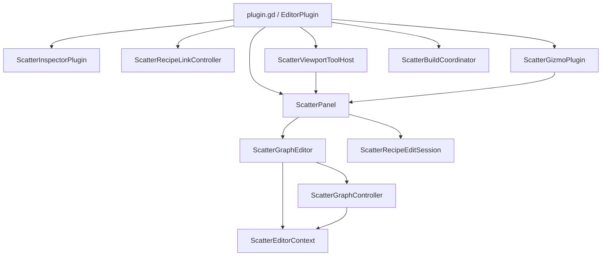
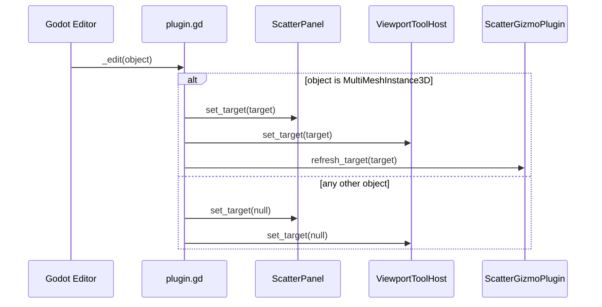
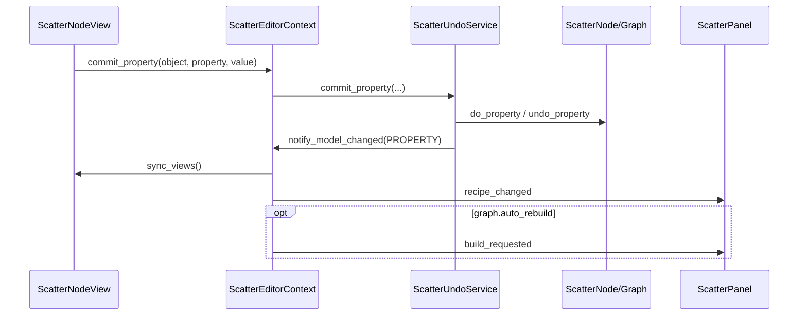
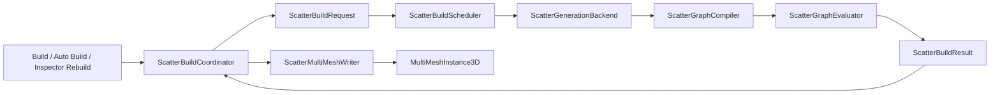

# Scatter Plugin Architecture and Data Flow

This document is intended for maintainers of the Scatter plugin. It describes the current architecture, especially the editor data flow, Recipe serialization, graph compilation and evaluation, instance calculations, and final MultiMesh buffer encoding.

Scatter is a **Godot editor-time generation plugin**. It evaluates a visual Scatter graph into `Transform3D`, color, and custom-data values, then writes those values into a native `MultiMeshInstance3D`. Exported games do not need custom Scatter scene nodes and do not evaluate Scatter graphs at runtime.

---

## 1. Core Design Principles

The current architecture follows these boundaries:

1. `core/` does not depend on `EditorPlugin`, `GraphNode`, `EditorUndoRedoManager`, or other editor UI types.
2. `editor/` owns selection, edit sessions, Undo/Redo, viewport tools, and UI. It does not implement generation algorithms.
3. Generation produces a `ScatterBuildResult`. Presentation is a separate step that writes the result into a `MultiMesh`.
4. The Recipe file, in-memory Working Graph, and generated MultiMesh are three independent states.
5. Graph ports use stable `StringName` IDs. Display labels are not part of the serialization protocol.
6. Each execution-plan node is evaluated at most once during a Build.
7. A failed Build never overwrites the Target's current MultiMesh buffer.

---

## 2. Directory Structure

```text
addons/scatter/
├─ plugin.gd
├─ plugin.cfg
├─ core/
│  ├─ execution/       Build requests, scheduling, plans, evaluation, diagnostics, cache APIs
│  ├─ graph/           Graph model, connections, ports, registries, and graph index
│  ├─ geometry/        Box, Sphere, Boolean, Path, Paint, and other geometry
│  ├─ nodes/           Serializable node models
│  │  ├─ base/
│  │  ├─ region/
│  │  ├─ placement/
│  │  ├─ transform/
│  │  ├─ filter/
│  │  ├─ data/
│  │  └─ output/
│  ├─ operations/      Creation, filtering, transforms, instance data, and math
│  ├─ values/          Runtime values such as Shape, Path, and Instances
│  └─ io/              Recipe attachment and MultiMesh presentation
├─ editor/
│  ├─ application/     Editor context, Recipe sessions, Undo, and Build coordination
│  ├─ graph/           GraphEdit, graph commands, clipboard, and node views
│  ├─ registry/        Built-in node and external-extension registration
│  ├─ extensions/      Node Gizmo and viewport-tool extension interfaces
│  ├─ gizmo/           Generic 3D Gizmo host and drawing sink
│  ├─ tools/           Paint and Path viewport tools
│  ├─ viewport/        Viewport-tool activation, forwarding, and cleanup
│  ├─ inspector/       MultiMeshInstance3D Inspector integration
│  └─ ui/              Panel, Toolbar, Recipe Sidebar, and Status Bar
├─ demo/
└─ tests/
```

### 2.1 Responsibilities of `plugin.gd`

`plugin.gd` is the composition root. It only:

- registers and unregisters built-in nodes;
- creates the Panel, Inspector integration, Gizmo, and Viewport Tool Host;
- connects Godot editor signals to application-layer controllers;
- retains the selected `MultiMeshInstance3D`;
- translates Build completion into UI updates, scene dirty state, and Gizmo refreshes.

Graph compilation, dependency scanning, Recipe attachment/detachment, and MultiMesh writing are implemented outside the entry point.

---

## 3. Editor Component Relationships



| Component | Responsibility |
| --- | --- |
| `ScatterPanel` | Current Target, Recipe Working Graph, Toolbar, Sidebar, dialogs, and status |
| `ScatterGraphEditor` | GraphEdit, node views, connection display, selection, menus, and shortcuts |
| `ScatterGraphController` | Add/Delete/Connect/Disconnect/Move/Paste/Toggle commands and Undo transactions |
| `ScatterEditorContext` | Unified Property, Structure, and Layout change notifications |
| `ScatterRecipeEditSession` | Source Graph, Working Graph, dirty state, scene ownership, and explicit saving |
| `ScatterRecipeLinkController` | Recipe attachment/detachment and their Undo/Redo actions |
| `ScatterBuildCoordinator` | Generation submission, completion handling, and main-thread Presentation |
| `ScatterGizmoPlugin` | 3D preview of the selected node and handle forwarding |
| `ScatterViewportToolHost` | Activation, input forwarding, toolbar state, and destruction of Paint/Path tools |

---

## 4. Editor Lifecycle

Initialization order:

```text
ScatterBuiltinRegistry.register_all()
    ↓
ScatterRecipeLinkController
    ↓
ScatterPanel + bottom panel
    ↓
ScatterInspectorPlugin
    ↓
ScatterGizmoPlugin
    ↓
ScatterViewportToolHost
    ↓
ScatterBuildCoordinator
```

Shutdown happens in reverse order. The Build scheduler and viewport tools stop first, then the Gizmo, Inspector, Panel, and node registry. A future asynchronous scheduler must cancel or ignore unfinished requests during `shutdown()`.

Object selection follows this flow:



---

## 5. The Three Recipe States

The most important editor data-flow rule is to keep these states distinct.

### 5.1 Source Graph

The Source Graph is the `ScatterGraph` loaded from an external `.tres` file. The scene references it through metadata:

```gdscript
const META_KEY := &"_scatter_graph"
target.set_meta(META_KEY, graph)
```

It must have a non-empty `resource_path` and keep `resource_local_to_scene = false`. Godot therefore encodes it in the `.tscn` as an `ExtResource`, not an embedded `SubResource`.

### 5.2 Working Graph

Opening a Recipe causes `ScatterRecipeEditSession` to call `source.duplicate_graph()` and create a deep working copy:

```text
source_graph (currently saved .tres content)
        │ duplicate(true)
        ▼
working_graph (in-memory editor state)
```

Node properties, connections, positions, Paint strokes, and Path points are edited on the Working Graph. Editing never implicitly overwrites the `.tres` file.

### 5.3 Generated MultiMesh

A Build writes an instance buffer into `MultiMeshInstance3D.multimesh`. This state is independent from the Recipe save state:

- Save Recipe: Working Graph → `.tres`;
- Build: Working Graph → MultiMesh buffer;
- Save Scene: metadata reference + current MultiMesh buffer → `.tscn`.

A Recipe can have unsaved edits while the scene already displays a Build from the latest Working Graph. Conversely, the Recipe may be saved while the scene still contains an older buffer.

---

## 6. Recipe Session and Save Flow

### 6.1 Opening a Target

`ScatterPanel._bind_target()`:

1. Reads `_scatter_graph` through `ScatterGraphAttachment`.
2. Generates a session key from the scene-context instance ID and `recipe_path`.
3. Reuses an existing `ScatterRecipeEditSession`, or creates one.
4. Passes the Target, Working Graph, and Undo manager to `ScatterGraphEditor.configure()`.
5. Rebuilds GraphEdit and refreshes the Toolbar and Sidebar.

Targets in the same scene that reference the same Recipe use the same session key and therefore share one Working Graph.

### 6.2 Dirty State

```text
model changed
    ↓
ScatterEditorContext
    ↓
ScatterGraphEditor.recipe_changed
    ↓
ScatterPanel._on_recipe_changed
    ├─ session.mark_dirty()
    ├─ show dirty state in Toolbar
    ├─ append * to the Sidebar filename
    ├─ emit recipe_changed
    └─ refresh Gizmo
```

### 6.3 Explicit Save

`ScatterRecipeEditSession.save()`:

1. Deep-copies the Working Graph so `ResourceSaver` cannot mutate the object being edited.
2. Saves the snapshot to the original `recipe_path`.
3. Reloads the disk version with `CACHE_MODE_IGNORE`.
4. Reuses Source Graph nodes where possible by matching `node_id + script`.
5. Synchronizes disk content back into the Source Graph.
6. Clears the dirty flag.

Reusing original node objects reduces invalidation of external references, Inspector state, and editor extensions after a save.

### 6.4 Attach and Detach

`ScatterRecipeLinkController` is the only metadata write path:

- `link(target, graph)`;
- `detach(target)`;
- with an `EditorUndoRedoManager`, both create complete do/undo actions;
- each application emits `changed(target)` so the Panel, Gizmo, and plugin entry point can refresh their own state.

Detach removes only `_scatter_graph` metadata. It does not delete the Recipe and does not clear the current MultiMesh.

---

## 7. Editor Change Data Flow

Model changes are classified into three kinds:

| ChangeKind | Examples | View behavior | Auto Build |
| --- | --- | --- | --- |
| `PROPERTY` | amount, radius, seed, enabled, Path/Paint data | Synchronize existing controls | Yes |
| `STRUCTURE` | Add, Delete, Connect, Disconnect, Paste | Deferred incremental reconciliation | Yes |
| `LAYOUT` | Move a GraphNode | Synchronize positions only | No |

The unified entry point is:

```gdscript
ScatterEditorContext.notify_model_changed(kind)
```

It emits the graph change, synchronizes controls or queues structural reconciliation, emits `recipe_changed`, and requests Auto Build when needed.

### 7.1 Property Editing and Undo/Redo



Numeric and vector drags use `UndoRedo.MERGE_ENDS` so tiny intermediate changes do not create separate Undo entries. Vector actions include X, Y, or Z in the action name to prevent different components from merging incorrectly.

### 7.2 Structural Editing

`ScatterGraphController` creates model transactions after GraphEdit emits add, delete, or connection signals. Structural changes are deferred until GraphEdit finishes dispatching the current input event:

```text
STRUCTURE change
    ↓
_queue_structure_reconcile()
    ↓ call_deferred
_flush_structure_reconcile()
    ↓
reconcile_graph_structure()
```

The editor compares the Working Graph with its rendered node signatures and connection keys. Add/Delete/Paste creates or removes only affected Views; ordinary Connect/Disconnect changes only the edge. A View is replaced locally when its port layout changes, notably for Final Output variadic rows and Shape Transform's adaptive geometry type. Unaffected Views retain object identity, selection, controls, and viewport-tool state.

Deferring avoids modifying a port hot zone while Godot is still handling a mouse-connection event, which could otherwise trigger box selection. Full `rebuild_graph()` remains available for initial configuration, Target/Recipe switches, registry changes, and recovery.

### 7.3 Layout Editing

Node drags are collected in `_pending_moves`. Moves from the same frame become one Undo action. Layout marks the Recipe dirty, but does not trigger Auto Build because screen position does not affect generated output.

### 7.4 Paint and Path Editing

Paint and Path tools edit properties on nodes in the Working Graph rather than manipulating GraphEdit directly:

- `ScatterPaintRegionNode.strokes`;
- `ScatterPathNode.points`;
- `ScatterPathNode.closed`.

Changes go through `ScatterUndoService` and `ScatterPanel.notify_viewport_data_changed()`, then enter the unified `PROPERTY` flow and refresh the Gizmo.

---

## 8. Node View Encoding

Most built-in nodes use `ScatterBuiltinNodeView` to generate UI dynamically instead of maintaining mirrored View scripts.

### 8.1 Port UI

The View reads:

```gdscript
model.get_input_ports()
model.get_output_ports()
```

Input and output ports with the same ID appear on the same row. GraphEdit uses integer visual type IDs internally; the model serializes stable `StringName` IDs.

### 8.2 Property UI

The View reads `model.get_property_list()` and chooses controls from the Variant type and `PropertyHint`:

| Model declaration | Editor control |
| --- | --- |
| exported `bool` | CheckBox |
| `@export_range(...)` | SpinBox |
| `@export_enum(...)` | OptionButton |
| `Vector2` / `Vector3` | Component SpinBoxes |
| `Color` | ColorPickerButton |
| `NodePath` | LineEdit |
| `@export_file` | File-path LineEdit |

Ranges and enums are defined once in the node model, preventing Model and View constraints from drifting. Final Output and Paint Region keep specialized Views because they need custom statistics or layout.

Each View exposes a structural signature derived from its visible port descriptors. Specialized Views extend the signature with layout dependencies; Final Output includes its incoming variadic connection count. The Graph editor stores the signature produced when a View is built and replaces that View only when the desired signature changes.

---

## 9. ScatterGraph Resource Serialization

`ScatterGraph` is the root Resource in a `.tres` Recipe:

```text
seed: int
auto_rebuild: bool
collision_mask: int
nodes: Array[ScatterNode]
connections: Array[ScatterConnection]
next_node_id: int
```

### 9.1 Node Encoding

Each `ScatterNode` is a Resource with these base fields:

```text
node_id: int
graph_position: Vector2
enabled: bool
override_seed: bool
custom_seed: int
```

Concrete nodes add parameters through `@export`. A `node_id` remains stable within one Recipe and identifies connections, Undo actions, cache-key domains, output statistics, and editor nodes.

### 9.2 Connection Encoding

`ScatterConnection` stores:

```text
from_node_id: int
from_port_id: StringName
to_node_id: int
to_port_id: StringName
order: int
```

A non-variadic input always normalizes `order` to `0`. Variadic inputs use continuous order values `0..n-1`; Final Output uses that order to concatenate instance streams.

Visual port positions and labels are not serialized. UI text can be renamed or translated without breaking Recipes.

### 9.3 Value Type System

Port types are stable IDs in `ScatterValueTypeRegistry`, not Godot class names:

```text
value
├─ shape
│  ├─ region
│  │  └─ regular_region
│  └─ path
├─ direct_sampleable
│  ├─ regular_region
│  └─ path
└─ instances
```

This is a multiple-parent type graph. `regular_region` is both a `region` and `direct_sampleable`; `path` is both a `shape` and `direct_sampleable`. Compatibility uses `is_assignable(actual, expected)` and caches the result.

`dynamic_geometry` exists only for the editor-time adaptive port on Shape Transform. Once connected, it must resolve to a concrete Shape, Region, Regular Region, or Path type.

---

## 10. End-to-End Build Flow



### 10.1 Build Coordinator

`ScatterBuildCoordinator.build(target, mark_unsaved)` resolves the Target's current Working Graph, creates one `ScatterBuildRequest`, and submits it to the configured scheduler. The completion callback remains the only path to Presentation: successful results are written through `ScatterMultiMeshWriter` on the editor thread, while failed results leave the current MultiMesh untouched.

### 10.2 Scheduler and Backend

Scheduling is split into two interfaces:

- `ScatterBuildScheduler.submit(request, completed)` decides when and where work runs.
- `ScatterGenerationBackend.generate(request)` synchronously performs one generation request.

Current default stack:

```text
ScatterInlineBuildScheduler
    └─ ScatterSynchronousGenerationBackend
          └─ ScatterBuildService.generate()
```

Execution is currently synchronous, but completion and Presentation are isolated. A future threaded scheduler can call the backend on a worker and dispatch `completed(result)` back to the main thread.

---

## 11. Graph Compilation

### 11.1 Graph Index

Compilation starts with one `O(V + E)` scan that creates `ScatterGraphIndex`:

```text
node ID → node
node ID → incoming connections
node ID → outgoing connections
(node ID, port ID) → incoming/outgoing connections for that port
duplicate node IDs
```

Evaluation does not repeatedly scan all `graph.nodes` and `graph.connections` for every node.

### 11.2 Static Validation

The compiler verifies:

1. Exactly one Final Output exists.
2. Node IDs are unique.
3. Both endpoint nodes exist for every connection.
4. Port IDs exist and are connectable.
5. Output types are assignable to input types.
6. A non-variadic input has at most one connection.
7. Variadic orders are unique and continuous.
8. The graph is acyclic.

Errors are stored in `ScatterExecutionPlan.diagnostics`. Evaluation does not start when the plan contains an Error.

### 11.3 Kahn Topological Sort

```text
calculate indegree for every node
    ↓
queue nodes whose indegree is 0
    ↓
pop each node and decrement downstream indegrees
    ↓
output count != node count → a cycle exists
```

This iterative implementation has no recursion-depth limit. The compiler then walks backwards from Final Output and keeps only ancestors that can affect the result, producing `ordered_node_ids`.

Gizmo preview calls `compile_node(graph, selected_node_id)`, retaining only the selected node and its ancestors instead of executing the complete Final Output path.

---

## 12. Graph Evaluation

`ScatterGraphEvaluator.execute(plan, context)` processes nodes in topological order.

For each node it:

1. Queries the Evaluation Cache.
2. Collects upstream `ScatterNodeOutputs` by input port and variadic order.
3. Calls `validate(context)`.
4. Calls `evaluate()` or `evaluate_disabled()`.
5. Verifies declared output ports, required outputs, and runtime types.
6. Writes outputs into the cache.
7. Records `Instances` output counts.

### 12.1 Inputs and Outputs

`ScatterNodeInputs` stores arrays of values by port ID:

```gdscript
inputs.first(&"shape")
inputs.all(&"instances")
inputs.shape()
inputs.path()
inputs.instances()
```

`ScatterNodeOutputs` stores one `ScatterValue` per output port ID. Base classes wrap ordinary single-output nodes; extension nodes may return multiple named outputs.

### 12.2 Disabled Nodes

Default disabled behavior passes the first available input to the first output. Base classes may override this:

- Placement nodes return a copy of input Instances.
- Region-source nodes return an Empty Region.
- Final Output cannot be disabled.

### 12.3 Deterministic Randomness

Each random node owns an independent RNG:

```gdscript
rng.seed = custom_seed \
    if override_seed \
    else graph.seed ^ (node_id * 0x45d9f3b)
```

Therefore identical graph seed, node ID, and parameters produce identical output. Changing sample count in one node does not consume another node's RNG sequence, and nodes can opt into custom seeds.

---

## 13. EvaluationSession, Diagnostics, and Cache

One `ScatterEvaluationSession` owns the cache and diagnostics for a Build execution:

```text
cache
evaluation_cache_hits
diagnostics
execution_id
output counts
```

### 13.1 Default Cache

`ScatterMemoryEvaluationCache` uses this key:

```text
execution_id : graph instance ID : target instance ID : node ID
```

A new Build increments the execution ID and clears the default memory cache. This prevents stale Node, Target, or physics-query results from crossing Build executions.

### 13.2 Future Persistent Content Cache

`ScatterEvaluationCache` is the replacement boundary. A stable cross-Build key must include at least:

```text
node type ID
+ serialized node properties
+ graph seed / build policy / algorithm version
+ ordered input content hashes
+ target-space snapshot
+ referenced resource fingerprint
+ physics/query snapshot version
```

Consistent hashing can assign an already-stable content key to cache shards. A Godot instance ID is not a persistent content identity.

The cache owns its output objects. `ScatterBuildService` copies Final Instances before returning so Presentation cannot mutate a cache entry.

### 13.3 Diagnostics

`ScatterDiagnostic` contains severity, stable code, node ID, message, and a details dictionary. A Warning may accompany a partial result, such as instance-limit truncation. An Error fails the Build and prevents MultiMesh Presentation.

---

## 14. Geometry and Coordinate Spaces

All final instance `Transform3D` values are stored in **Target MultiMesh Local** space.

### 14.1 Shape Interface

`ScatterShapeValue` provides:

- a local transform;
- a local AABB;
- `contains_local(point)`;
- local/shape coordinate conversion.

`ScatterRegularRegionValue` adds exact uniform sampling. Box and Sphere are Regular Regions.

`ScatterPathValue` stores points, closed state, cumulative arc lengths, and a local transform. It samples by total arc length.

### 14.2 Space Enumeration

```text
Global    world coordinates
Local     MultiMeshInstance3D local coordinates
Instance  each instance's own coordinate axes
```

Global Shape/Path data is frozen into Target-local space during evaluation. Transform nodes use the selected space to compose offset, rotation, and scale.

### 14.3 Transformed Wrappers

Shape Transform does not mutate its input. It creates one of these wrappers:

- `ScatterTransformedShape`;
- `ScatterTransformedPath`;
- `ScatterTransformedRegion`;
- `ScatterTransformedRegularRegion`.

This lets multiple downstream branches safely share upstream values and keeps coordinate conversions explicit.

---

## 15. Placement Calculations

### 15.1 Random

- Path: directly sample a random arc-length parameter.
- Regular Region: call exact `sample_local()`.
- General Shape: rejection-sample inside the local AABB, then call `contains_local()`.

General-Shape rejection budget:

```text
min(REJECTION_CAP, max(256, requested * 32))
REJECTION_CAP = 8,000,000
```

Very thin Boolean Shapes or low-fill Shapes may generate fewer instances than requested. Statistics or diagnostics expose the shortfall.

### 15.2 Grid

1. Convert the Shape AABB into grid space.
2. Calculate the first grid point on each axis from spacing and phase offset.
3. Enumerate points with three nested loops.
4. Convert to Shape-local space and test containment.
5. Stop at the Build instance limit.

### 15.3 Poisson

- Volume mode uses a deterministic 3D Bridson active list and spatial grid.
- Path mode samples random arc-length candidates and checks minimum Euclidean distance.
- `samples_before_rejection` controls candidates per active point.
- `max_points` and the global instance limit jointly bound output.

### 15.4 Path Placement

- Random: random positions along total arc length.
- Even: increment distance by spacing from an offset.
- Continuous: derive count from item length and use cell centers.
- Align: construct a basis from tangent and up vectors.

---

## 16. Instances Data and Operations

`ScatterInstances` maintains three equal-length arrays:

```text
transforms: Array[Transform3D]
colors: Array[Color]
custom_data: Array[Color]
```

`normalize()` fills missing color/custom-data values with defaults and truncates excess values.

Nodes normally call `duplicate_instances()` before modification so one branch cannot mutate upstream output shared by another branch. Final Output and Merge create new containers and append in batches.

### 16.1 Transform Operations

Transform, Position, Rotation, Scale, and Random Transform update the copied `Transform3D` array in place by index. Batch constants such as Target frame and rotation basis are computed outside instance loops.

### 16.2 Filter Operations

Remove Outside and Remove Random first build a `PackedByteArray` keep mask, then compact all arrays in one read/write pass:

```text
read_index  → scan original data
write_index → write retained data
resize all arrays once at the end
```

This is `O(n)` and avoids quadratic movement from repeated `remove_at()` calls.

### 16.3 Global Instance Limit

Default Build limit:

```text
1,000,000 instances
```

Creation nodes, Array, Merge, and Final Output must respect `context.maximum_instances`. Final Output truncates by variadic connection order and adds a Warning.

Gizmo preview uses a separate 2,000-instance limit so editor refreshes do not generate the full production result.

---

## 17. MultiMesh Buffer Encoding

`ScatterMultiMeshWriter` is the Presentation boundary and accepts only a successful `ScatterBuildResult`.

### 17.1 MultiMesh Compatibility

A new local-to-scene MultiMesh is created when:

- the Target has no MultiMesh;
- the current MultiMesh is not `resource_local_to_scene`;
- its transform format is not `TRANSFORM_3D`;
- colors are disabled;
- custom data is disabled.

On replacement, the writer preserves the original Mesh, custom AABB, and physics interpolation quality.

### 17.2 Twenty Floats per Instance

Each instance uses 20 `float32` values in Godot's 3D MultiMesh buffer:

| Offset | Content |
| ---: | --- |
| 0–3 | `basis.x.x, basis.y.x, basis.z.x, origin.x` |
| 4–7 | `basis.x.y, basis.y.y, basis.z.y, origin.y` |
| 8–11 | `basis.x.z, basis.y.z, basis.z.z, origin.z` |
| 12–15 | `color.r, color.g, color.b, color.a` |
| 16–19 | `custom.r, custom.g, custom.b, custom.a` |

```text
3 × vec4 transform rows
+ 1 × vec4 color
+ 1 × vec4 custom data
= 20 float32 values per instance
```

The writer preallocates once:

```gdscript
buffer.resize(instance_count * 20)
```

It writes directly by offset without a temporary Array per instance. Before writing, it resets `instance_count` to zero to accommodate Godot's allocation-format restrictions. Finally, it sets `visible_instance_count = -1`.

---

## 18. Gizmo and Viewport-Tool Data Flow

```text
GraphNode selected
    ↓
ScatterGraphEditor._set_active_viewport_view
    ↓ viewport_tool_changed(node_id, tool_id)
ScatterPanel
    ↓ viewport_tool_changed(tool_id, node_id)
plugin.gd
    ├─ Gizmo.set_active_node
    └─ ViewportToolHost.select
```

### 18.1 Generic Preview

`ScatterDefaultEditorExtension` calls `compile_node()` for the selected node and its ancestors:

- Region: draw edge lines.
- Path: draw segment lines.
- Instances: draw local-axis markers for at most 2,000 instances.

The Gizmo host does not hard-code concrete node types. Registered editor extensions provide node-specific behavior.

### 18.2 Path Tool

The Path Tool supports Edit, Create, and Delete:

- raycast against collision surfaces first;
- use a camera-oriented editing plane on a miss;
- always store points in Target-local space;
- route Closed, Add, and Delete through `UndoService`.

### 18.3 Paint Tool

The Paint Tool raycasts with the graph collision mask and creates `ScatterPaintStroke` values. Erase, Radius, Clear Layer, and stroke edits update the Working Graph. The unified `PROPERTY` flow handles dirty state, Gizmo refresh, and optional Auto Build.

---

## 19. Extension Mechanism

An external addon registers a node with up to three layers:

```gdscript
ScatterExtensionRegistry.register_node(
    MyScatterNode,
    MyScatterNodeView,
    MyScatterNodeEditorExtension,
)
```

### 19.1 Model

Extend `ScatterNode` and provide a stable type ID, caption/category/color, ports, and `evaluate_value()` or multi-output `evaluate()`. Validation, seed, disabled, and dynamic-port behaviors are optional.

### 19.2 View

Reuse the exported-property form in `ScatterBuiltinNodeView`, or extend `ScatterNodeView` for a fully custom layout.

### 19.3 Editor Extension

`ScatterNodeEditorExtension` can provide Gizmo drawing, a viewport tool, handle interactions, and selected/deselected hooks.

Custom value types are registered with `ScatterValueTypeRegistry.register_type()` and may declare multiple parents.

---

## 20. Multithreading Boundary

Worker-thread execution is not enabled in this version, but the interfaces are separated.

A threaded scheduler must obey these rules:

1. `submit()` may run Generation in the background.
2. `completed(result)` must return to the Godot editor main thread.
3. `ScatterMultiMeshWriter`, SceneTree, EditorPlugin, UI, and Gizmo APIs are main-thread-only.
4. Requests need revisions; stale results cannot overwrite newer edits.
5. Shutdown must cancel or ignore unfinished work.
6. Nodes using `PhysicsDirectSpaceState`, `Node`, or `Resource` data need a thread-safe snapshot or a main-thread phase.

Intended future flow:

```text
Main Thread: capture immutable BuildRequest snapshot
    ↓
Worker Thread: compile + evaluate pure nodes
    ↓
Main Thread: validate revision + present MultiMesh + refresh UI
```

Do not move the current `ScatterBuildRequest`, which holds live Scene Nodes, directly to a worker without defining a safe snapshot first.

---

## 21. Coding and Maintenance Rules

### 21.1 Classes and Files

- One primary `class_name` maps to one snake_case `.gd` file.
- Core classes do not reference editor classes.
- External extensions should depend on `class_name` and registry APIs, not internal paths.
- Move Godot `.uid` files with scripts to preserve `.tres` and `.tscn` references.

### 21.2 IDs

- Node type, value type, and port IDs use `StringName`.
- IDs are persistent protocol values; UI labels may change.
- Published IDs should not change for cosmetic reasons.
- `node_id` is unique only within one graph.

### 21.3 Ownership

- EditSession owns the Working Graph.
- Evaluation Cache owns cached outputs.
- BuildResult copies Final Instances at the cache boundary.
- Transform/filter nodes modify copies, not shared upstream Instances.
- The writer may normalize a successful result, but never modifies the Target after failure.

### 21.4 Errors

- Recoverable partial-output conditions use Warning.
- Structural, type, cycle, and output-protocol failures use Error.
- Diagnostics should include a stable code, node ID, and details.
- UI shows the first error; the full array remains available to tests and a future diagnostics panel.

### 21.5 Performance

- Avoid temporary Array/Dictionary allocation inside instance loops.
- Compute batch constants outside hot loops.
- Compact large arrays instead of repeatedly removing items.
- Use `ScatterGraphIndex` for graph algorithms.
- Do not execute complete Final Output during high-frequency Gizmo refreshes.
- New nodes must respect `context.maximum_instances`.

---

## 22. Tests and Verification

Recommended order:

```bash
godot --headless --path . --editor --quit
godot --headless --path . --script res://addons/scatter/tests/run_all.gd
godot --headless --path . --script res://addons/scatter/tests/benchmark_core.gd
```

The first command forces Godot to reimport moved scripts and refresh the global class cache.

Coverage includes:

- registry and all built-in nodes;
- graph compile/evaluate/type/cache/cycle behavior;
- placement, transform, filter, and geometry operations;
- core/editor dependency rules;
- Recipe defaults and explicit saving;
- GraphEdit incremental Add/Delete/Connect/Disconnect/Paste, Undo/Redo reconciliation, Sidebar, Path/Paint, and session lifecycle;
- Path Extrude;
- BuildCoordinator and synchronous/delayed schedulers;
- Demo Recipe loading and real Builds.

The test runner treats `SCRIPT ERROR`, assertions, and `ERROR:` output as failures in addition to checking process exit codes.

---

## 23. Common Modification Entry Points

| Requirement | Preferred location |
| --- | --- |
| Add a node model | `core/nodes/<category>/` |
| Add a generation algorithm | `core/operations/` |
| Add a Shape or Region | `core/geometry/` + `core/values/` |
| Change connection rules | `core/graph/scatter_connection_service.gd` |
| Change compiler validation | `core/execution/scatter_graph_compiler.gd` |
| Change evaluation protocol | `core/execution/scatter_graph_evaluator.gd` |
| Change MultiMesh encoding | `core/io/scatter_multimesh_writer.gd` |
| Change generic node forms | `editor/graph/views/scatter_builtin_node_view.gd` |
| Change GraphEdit commands | `editor/graph/scatter_graph_controller.gd` |
| Change Recipe sessions | `editor/application/scatter_recipe_edit_session.gd` |
| Change Build batches/dependencies | `editor/application/scatter_build_coordinator.gd` |
| Add thread scheduling | Implement `ScatterBuildScheduler` |
| Add a cross-Build cache | Implement `ScatterEvaluationCache` |

---

## 24. Complete User-Action Example

Changing Random Placement amount with Auto Build enabled follows this path:

```text
SpinBox.value_changed
    ↓
ScatterBuiltinNodeView._number_changed
    ↓
ScatterEditorContext.commit_property
    ↓
ScatterUndoService creates or merges an Undo action
    ↓
ScatterRandomNode.amount is updated
    ↓
notify_model_changed(PROPERTY)
    ├─ graph.emit_changed
    ├─ sync_views
    ├─ Panel marks EditSession dirty
    ├─ Sidebar/Toolbar show dirty state
    └─ build_requested
          ↓
      plugin.gd._build_current
          ↓
      ScatterBuildCoordinator
          ↓ scheduler.submit(BuildRequest)
                ↓
            GenerationBackend
                ├─ GraphIndex
                ├─ Compiler
                ├─ EvaluationSession/Cache
                ├─ node Operations
                └─ ScatterBuildResult
                      ↓ completion
            BuildCoordinator main-thread Presentation
                ├─ MultiMeshWriter writes the 20-float buffer
                ├─ build dependents
                └─ build_succeeded
                      ↓
            plugin.gd marks scene dirty and refreshes Inspector, Gizmo, and Status Bar
```

This path summarizes the architecture's main objective: model editing, editor state, generation, and scene presentation remain separate layers connected through stable, testable interfaces.
