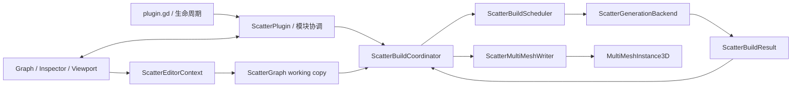

# Scatter 架构

本文描述重构后的代码边界、构建数据流和扩展约束。Scatter 是 Godot 编辑器插件；生成后的场景只包含原生 `MultiMeshInstance3D`，运行时不执行 Scatter 图。

## 目录

```text
addons/scatter/
├─ core/
│  ├─ execution/   构建请求、调度接口、编译计划、求值上下文、诊断与缓存接口
│  ├─ graph/       图、节点连接、端口、类型注册表和只读图索引
│  ├─ io/          Recipe 附着和 MultiMesh 结果写入
│  ├─ nodes/       可序列化节点模型，按 Shape / Placement / Transform / Filter / Data / Output 分类
│  ├─ operations/  实例创建、变换、过滤、数据写入及数学算法
│  ├─ geometry/    Shape / Region 的几何实现
│  └─ values/      求值期间传递的 Shape、Path、Instances 等值对象
├─ editor/
│  ├─ application/ 插件协调器、编辑会话、Undo、Recipe IO、构建协调器和编辑上下文
│  ├─ graph/       GraphEdit、图命令控制器、剪贴板和节点视图
│  ├─ registry/    内置节点与外部扩展注册
│  ├─ extensions/  节点编辑扩展接口
│  ├─ gizmo/       通用 3D Gizmo 宿主
│  ├─ tools/       Paint 与 Path 视口工具
│  ├─ viewport/    视口工具生命周期管理
│  ├─ inspector/   原生 MultiMeshInstance3D Inspector 集成
│  └─ ui/          Panel、Toolbar、Sidebar、StatusBar
├─ tests/
└─ plugin.gd       仅负责 EditorPlugin 生命周期和组件装配
```

目录按“变化原因”分组。核心算法不依赖编辑器 API；编辑器 UI 不拥有生成算法；节点表单与节点模型不再维护两套范围和枚举定义。

## 重构前问题与处理

| 问题 | 影响 | 当前处理 |
| --- | --- | --- |
| `core/services` 同时包含编译器、实例算法、资源附着和 MultiMesh 写入 | 修改原因混杂，线程边界不可见 | 拆为 `execution / graph / operations / io` |
| `core/nodes/<category>` 与 `editor/views/<category>` 为每个节点维护镜像脚本 | 端口、范围、枚举和文案容易漂移 | 通用视图读取节点端口和 `@export` 元数据，仅保留特殊视图 |
| `plugin.gd` 同时处理生命周期和模块间信号/Target/Build UI 流 | 入口承担业务协调，组件难以独立演进和测试 | `plugin.gd` 只装配与销毁；`ScatterPlugin` 负责应用协调 |
| 编译器和求值器反复调用 `find_node/incoming_connections` | 大图趋向重复扫描，深图递归还会耗尽栈 | `ScatterGraphIndex` + 迭代式拓扑排序 |
| Evaluation cache 用 instance ID 字符串且没有 Build 边界 | 会话复用时可能读到图或 Target 修改前的值 | execution ID 隔离默认缓存；持久缓存通过接口自行提供内容键 |
| Filter 对三个数组逐项 `remove_at` | 大实例数最坏出现平方级搬移 | 单次 keep-mask 线性压缩 |
| MultiMesh pack 每个实例创建临时 20 元素 Array | 产生大量短生命周期分配 | 直接写入预分配 PackedFloat32Array |
| Gizmo 预览为所选节点执行完整 Final Output 图 | 频繁刷新可能生成百万实例 | `compile_node()` 只执行祖先，预览上限 2,000 |
| Graph、Panel、Paint、Path 多处复制 changed/sync/dirty/auto-build 链路 | 通知重复且容易漏掉某一步 | `ScatterEditorContext` 统一 Property/Structure/Layout 变更 |
| Recipe attach/detach 分散在 Panel 与 EditorPlugin | Undo、刷新和元数据通知存在两套实现 | `ScatterRecipeLinkController` 统一事务 |
| 测试只看 Godot 子进程退出码 | GDScript assertion 失败仍可能被误报为通过 | runner 同时扫描 `SCRIPT ERROR`、assertion 和 `ERROR:` |

## 总体数据流

`plugin.gd` 是 Godot 生命周期适配器：它创建、配置、注册和反注册组件，并把 `_edit`、`_make_visible`、`_forward_3d_gui_input` 回调转发给 `ScatterPlugin`。`ScatterPlugin` 是应用协调器：它连接 Panel、Inspector、Recipe Link、Gizmo、Viewport Tool Host 和 Build Coordinator 的信号，持有当前 Target，并负责 Build 后的状态、场景 dirty 标记和 Gizmo 刷新。协调器不拥有组件注册，关闭时先断开所有信号，再由 `plugin.gd` 按逆序销毁组件。



构建分为两个明确阶段：

1. **Generation**：图编译和求值只产生 `ScatterBuildResult`，不写 `MultiMesh`。
2. **Presentation**：协调器收到完成回调后，才在编辑器线程调用 `ScatterMultiMeshWriter`。

默认 `ScatterInlineBuildScheduler` 会立即调用 `ScatterSynchronousGenerationBackend`，因此本版本行为仍是同步的。调度 API 已经使用 `submit(request, completed)`，未来线程调度器可以在后台生成，并把完成回调投递回编辑器线程；展示代码和插件入口不需要改写。

## 图编译和求值

`ScatterGraphCompiler` 每次编译先创建 `ScatterGraphIndex`。索引一次性建立：

- `node_id -> ScatterNode`
- 每个节点的入边
- 每个节点的出边
- 重复节点 ID

编译器使用索引验证端口、类型、变长输入顺序和环，再生成稳定拓扑计划。求值器只读取 `ScatterExecutionPlan.index`，不再为每个节点和每个端口反复扫描整个节点/连接数组。

完整 Build 使用 `compile()` 生成 Final Output 的祖先计划。Gizmo 预览使用 `compile_node()`，只求值所选节点及其祖先，并将实例上限设为 2,000；预览不会再为了显示上游节点而执行全部下游图和百万级 Final Output。

## 缓存边界

`ScatterEvaluationSession` 依赖抽象的 `ScatterEvaluationCache`。默认 `ScatterMemoryEvaluationCache`：

- 只在一次根 Build 中复用中间输出；
- 新 Build 开始时清空临时条目，避免图、Target 或物理世界变化后读到旧结果；
- output count 按 execution / graph / target 分域，不再因不同图使用相同 node ID 而覆盖。

未来的内容寻址缓存可以实现同一接口，并把键替换为稳定内容键。稳定键至少必须覆盖：

```text
node type + serialized node properties + graph seed
+ ordered input content hashes
+ target-space snapshot
+ external resource fingerprints
+ build policy/version and instance limit
+ physics/query snapshot version (when applicable)
```

一致性哈希环只负责把稳定键映射到缓存分片；它不能代替内容键，也不能直接使用 Godot instance ID。包含 PhysicsDirectSpaceState、未冻结 Resource 或场景 Node 引用的节点必须声明不可跨 Build 缓存，或先生成线程安全快照。

## 编辑器变更流

属性、结构和布局变更统一通过 `ScatterEditorContext.notify_model_changed(kind)`：

| Change kind | 更新模型信号 | 更新视图 | 标记 Recipe dirty | Auto Build |
| --- | --- | --- | --- | --- |
| Property | 是 | 同步控件 | 是 | 是 |
| Structure | 是 | 延迟增量协调节点与连接 | 是 | 是 |
| Layout | 是 | 同步位置 | 是 | 否 |

Graph controller、节点表单、Paint、Path 和图级属性不再各自复制 `emit_changed → sync_views → dirty → auto build` 链路。结构通知通过 `call_deferred` 合并到一次模型/视图差异协调：Add/Delete/Paste 只增删相关 View，普通 Connect/Disconnect 只改连线；Final Output 变长输入和 Shape Transform 动态端口变化时仅重建受影响 View。完整 `rebuild_graph()` 只用于首次配置、Target/Recipe 切换、Registry 变化和异常恢复。`ScatterUndoService` 只负责事务和回调；没有 EditorUndoRedoManager 的测试/工具环境也会正确发出 Resource changed。

## 节点视图

大多数节点使用 `ScatterBuiltinNodeView`。它直接读取节点的：

- `get_input_ports()` / `get_output_ports()`；
- `get_property_list()`；
- Property type、`hint`、`hint_string` 和 `usage`；
- `@export_category`、`@export_group`、`@export_subgroup` 的有序布局标记。

显式 Category、Group、Subgroup 显示为静态层级标题；前缀用于决定属性归属并从最终标签移除。自动脚本类 Category、空分组、隐藏属性和不支持的类型不会产生标题。真实属性必须同时包含 `PROPERTY_USAGE_EDITOR` 和 `PROPERTY_USAGE_SCRIPT_VARIABLE`；`PROPERTY_USAGE_READ_ONLY` 会保留字段但禁用控件。

通用视图支持 Range 的边界、步长、越界、指数、后缀和角度转换，保留 Enum 的显式值，并支持 String Enum/Suggestion、Flags/Layers、普通/Placeholder/Password/Multiline String、文件/保存/目录选择、无 Alpha Color、Vector 后缀及 NodePath。Array、Dictionary、Resource/Object、Callable/tool button、Property Array 和自定义 Inspector 仍需要专用 View。

因此节点属性布局、范围和值选项只定义一次。只有需要特殊运行统计或交互布局的 Final Output 和 Paint Region 保留专用视图。外部插件仍可通过 `ScatterExtensionRegistry.register_node()` 注册完全自定义的视图和 editor extension。

## 主要性能修正

- 图编译/求值由重复线性扫描改为一次索引后近似 `O(V + E)` 遍历。
- Remove Outside / Remove Random 使用线性压缩，不再对三个数组反复 `remove_at()` 导致最坏 `O(n²)` 搬移。
- MultiMesh buffer 写入不再为每个实例创建 20 元素临时 Array。
- GraphEdit 结构编辑使用延迟增量协调，不再销毁并重建全部节点 View。
- Random Transform 将 Target frame 计算移出实例循环。
- `ScatterInstances.append_instances()` 使用批量追加。
- 所选节点预览只执行其祖先，并设置独立实例上限。

Godot 4.7.1 下的仓库基准脚本在本次重构环境中，编译 2,002 节点链约 30–40 ms，线性过滤 100,000 个实例约 45–55 ms。基准不设硬编码时间门槛，避免不同机器产生假失败；它会验证结果规模并打印可比较数据。图编译已改为迭代式 Kahn 拓扑排序，深图不会再触发递归栈下溢。

## 线程化约束

线程调度器必须遵守以下契约：

1. `submit()` 可以异步执行 Generation，但完成回调必须回到编辑器主线程。
2. `ScatterMultiMeshWriter`、EditorPlugin API、SceneTree 修改和 UI 更新只能在主线程执行。
3. 当前部分节点读取 Node transform、Resource 或物理空间；线程实现必须在提交前捕获不可变输入，或把这些节点安排在主线程阶段。
4. 调度器必须支持丢弃过期 revision 的结果，避免较早请求覆盖较新编辑结果。

本版本只提供接口和阶段隔离，不启用工作线程，也不启用跨 Build 内容缓存。

## 架构不变量

- `core/` 不引用 `EditorPlugin`、`GraphNode`、`EditorUndoRedoManager` 或 Control。
- 每个图恰好有一个 Final Output；所有连接使用稳定 `StringName` port ID。
- 每个 Build 中，每个计划节点最多执行一次。
- 生成失败不会改写现有 MultiMesh。
- Recipe working copy、外部 `.tres` 和场景中的生成结果是三个不同状态，只有显式 Save/Build 各自更新对应状态。
- 所有内置节点必须同时注册 model、view 和 editor extension。

## 验证

```bash
godot --headless --path . --editor --quit
godot --headless --path . --script res://addons/scatter/tests/run_all.gd
godot --headless --path . --script res://addons/scatter/tests/benchmark_core.gd
```

测试入口会把子进程中的 `SCRIPT ERROR`、assertion 和 `ERROR:` 视为失败；不再只依赖 Godot 子进程退出码。
